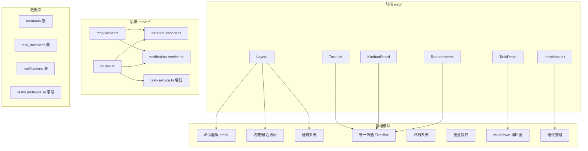

## 产品概述

基于对 Plane 项目管理工具的分析，为 ClawPM 实现 8 项高价值功能增强，覆盖命令面板、统一筛选、迭代管理、富文本编辑、归档机制、批量操作、收藏/最近访问、通知系统。同时需要将 PRD 和技术设计文档更新至 v3.0。

## 核心功能

### F1: Cmd+K 命令面板

全局命令面板，支持快捷键 Cmd/Ctrl+K 唤起，提供全局搜索（任务、项目）和快捷操作（跳转页面、创建任务、切换项目），任务搜索支持按 taskId 和标题模糊匹配。

### F2: 统一筛选/视图保存

提取各页面分散的筛选逻辑为统一的 FilterBar 组件和 useFilters Hook，支持按状态、优先级、负责人、里程碑、标签、日期范围筛选。视图配置（筛选条件+排序）可命名保存到 localStorage，在 TaskList、KanbanBoard、Requirements 等页面复用。

### F3: 迭代 (Cycles) 管理

新增迭代概念，迭代有名称、起止日期、状态（未开始/进行中/已完成），可将任务关联到迭代。提供迭代列表页和迭代详情页（显示关联任务、完成率、燃尽进度）。侧边栏"执行跟踪"分组新增"迭代"导航项。

### F4: 富文本描述编辑器

将任务详情页的 description textarea 升级为 Markdown 编辑器，支持编辑/预览切换，渲染表格、代码块、任务列表等 GFM 语法。无需引入重型编辑器，使用 textarea + Markdown 渲染预览的轻量方案（项目已有类似附件文档的模式可复用）。

### F5: 归档机制

前端实现项目归档/恢复按钮（后端 archived 字段已存在）。项目列表默认隐藏已归档项目，提供"显示归档"开关。任务支持软删除（新增 archivedAt 字段），归档后从列表/看板/树隐藏，可在专门的"归档"页面查看和恢复。

### F6: 批量操作

任务列表页和看板页支持多选任务（复选框/Shift 多选），选中后底部弹出操作栏，支持批量修改状态、负责人、优先级、标签。后端新增批量更新 API。

### F7: 收藏/最近访问

侧边栏导航区新增"收藏"和"最近访问"快捷入口。收藏存储在 localStorage（轻量方案），记录用户收藏的任务 taskId。最近访问自动记录最近打开过的 10 个任务，按时间倒序展示。

### F8: 站内通知系统

新增 notifications 表，当任务状态变更、被指派、被评论时自动生成通知。提供通知铃铛图标（Layout 顶部）、通知列表弹出面板、标记已读功能。通知以轮询方式获取（每 30 秒），不引入 WebSocket。

## 技术栈

- **前端**: React 18 + Vite 5 + TailwindCSS 3 + ReactFlow 12 + TanStack Query 5 + react-router-dom 7
- **后端**: Fastify + Drizzle ORM + better-sqlite3 (SQLite)
- **Monorepo**: pnpm workspace (server/ + web/)
- **新增依赖**: `cmdk`（命令面板）、`react-markdown` + `remark-gfm`（Markdown 渲染，附件系统文档已提到但未安装）

## 实现方案

### 总体策略

8 个功能按依赖关系和改动范围分为 3 个层级实施：

1. **基础层**（无外部依赖，纯增量）：归档机制(F5)、收藏/最近访问(F7)
2. **数据层**（需要新增 DB 表/字段+API）：迭代管理(F3)、批量操作(F6)、通知系统(F8)
3. **UI 层**（依赖上层数据）：命令面板(F1)、统一筛选(F2)、富文本描述(F4)

### 关键技术决策

**F1 命令面板 — cmdk 库**：

- 选用 `cmdk` 库（MIT 协议，3KB gzip，无需额外 UI 框架）
- 在 Layout.tsx 注册全局 `Cmd+K` / `Ctrl+K` 快捷键
- 命令分组：导航跳转、任务搜索（调用 `api.getTasks` 并按标题/taskId 模糊匹配）、快捷操作（创建任务、切换项目）
- 搜索 debounce 300ms，前端匹配，无需新增搜索 API（数据量在 1000+ 节点内，前端过滤即可）

**F2 统一筛选 — 可复用 Hook + 组件**：

- 提取 `useFilters(storageKey)` hook，管理筛选状态、持久化到 localStorage
- 提取 `FilterBar` 组件，按需组合筛选维度（状态/优先级/负责人/里程碑/标签/日期）
- 视图保存：`SavedView = { name, filters, sort }` 数组存储在 localStorage `clawpm-saved-views-{page}`
- 改造 TaskList、KanbanBoard、Requirements 页面复用 FilterBar

**F3 迭代管理 — 新表 + CRUD**：

- 新增 `iterations` 表（id, projectId, name, description, startDate, endDate, status）
- 新增 `task_iterations` 关联表（taskId, iterationId），一个任务可属于多个迭代
- 后端新增 IterationService + CRUD API + MCP 工具
- 前端新增 Iterations 列表页 + 迭代详情页
- 迭代详情页显示：基本信息、任务列表（复用 FilterBar）、完成率环形图

**F4 富文本描述 — Markdown 编辑/预览**：

- 安装 `react-markdown` + `remark-gfm`（技术文档已提到，附件系统的 MD 文档编辑器模式）
- TaskDetail.tsx 中 description 区域改为双模式：编辑态（textarea with monospace font）/ 预览态（渲染后的 Markdown）
- 点击预览区切换到编辑态，失焦或 Ctrl+Enter 保存并切回预览态
- 复用附件系统已有的 Markdown 渲染思路

**F5 归档机制**：

- **项目归档**：后端已有 `projects.archived` 字段和 `ProjectService.update(slug, { archived: true })`，前端项目列表增加归档/恢复按钮和筛选开关
- **任务归档**：tasks 表新增 `archived_at TEXT` 字段，`TaskService.list()` 默认过滤 `archived_at IS NULL`，新增归档/恢复 API
- 前端在任务右键/更多菜单增加"归档"操作，侧边栏设置区新增"归档箱"页面

**F6 批量操作**：

- 后端新增 `PATCH /api/v1/tasks/batch` 端点，接受 `{ task_ids: string[], updates: UpdateTaskParams }`
- TaskList 页面表格行增加复选框列，Shift+Click 范围选择
- 选中后底部 fixed 弹出操作栏：状态下拉、负责人下拉、优先级下拉、应用按钮
- KanbanBoard 同理增加多选模式

**F7 收藏/最近访问 — 纯前端 localStorage**：

- `useRecentTasks()` hook：在 TaskDetail 打开时自动记录，保留最近 10 个 `{ taskId, title, timestamp }`
- `useFavorites()` hook：星标切换，存储收藏的 taskId 集合
- Layout 侧边栏导航区顶部新增"最近访问"和"收藏"可折叠分组，显示任务快捷链接

**F8 站内通知**：

- 新增 `notifications` 表（id, projectId, recipientId, type, title, content, taskId, isRead, createdAt）
- 通知类型：task_assigned（被指派）、status_changed（状态变更）、note_added（新评论）
- 后端在 TaskService.update/addNote 等方法中插入通知记录
- 新增通知 API：`GET /api/v1/notifications`（轮询）、`PATCH /api/v1/notifications/:id/read`（标记已读）
- 前端 Layout 顶部增加铃铛图标 + 未读计数 badge + 通知面板弹出

## 实现注意事项

1. **向后兼容**：所有新增字段使用 `ALTER TABLE ADD COLUMN ... DEFAULT` 迁移，不破坏现有数据
2. **性能**：命令面板搜索使用 debounce + 前端过滤避免频繁 API 调用；批量操作使用事务包裹；通知轮询间隔 30s 避免服务器压力
3. **代码复用**：统一筛选的 FilterBar 跨页面复用减少重复代码；Markdown 渲染复用附件系统方案
4. **迁移安全**：SQLite 迁移全部使用 `try { ALTER } catch {}` 模式（已有约定），CREATE TABLE 使用 `IF NOT EXISTS`
5. **MCP 工具同步**：迭代管理和归档功能需同步新增 MCP 工具，保持 GUI 和 Agent 双通道能力一致
6. **日志**：通知生成使用 Fastify 内置 logger 记录关键操作，不引入额外日志框架

## 架构设计

### 系统架构变更



### 数据流

- 命令面板：前端 getTasks → 内存搜索 → 展示结果 → 跳转
- 统一筛选：FilterBar 组件 → useFilters Hook → URL params / localStorage → API 调用
- 迭代管理：前端 CRUD → REST API → IterationService → SQLite iterations/task_iterations
- 通知：任务操作 → TaskService 自动生成通知 → 前端轮询 GET /notifications → 铃铛展示

## 目录结构

```
server/src/
├── db/
│   ├── schema.ts                    # [MODIFY] 新增 iterations、task_iterations、notifications 三张表定义；tasks 表新增 archived_at 字段
│   └── connection.ts                # [MODIFY] 新增三张表的 CREATE TABLE IF NOT EXISTS 迁移；tasks 表 ALTER TABLE ADD COLUMN archived_at 迁移
├── services/
│   ├── task-service.ts              # [MODIFY] list() 增加 archived_at 过滤；新增 archive/unarchive/batchUpdate 方法；update/addNote 等操作中调用 NotificationService 生成通知
│   ├── iteration-service.ts         # [NEW] 迭代 CRUD 服务：create/list/getById/update/delete/addTask/removeTask/getTasksByIteration
│   └── notification-service.ts      # [NEW] 通知服务：create/listByRecipient/markAsRead/markAllAsRead/getUnreadCount
├── api/
│   └── routes.ts                    # [MODIFY] 新增迭代 CRUD 路由(/api/v1/iterations/*)、批量更新路由(/api/v1/tasks/batch)、归档路由(/api/v1/tasks/:taskId/archive)、通知路由(/api/v1/notifications/*)
└── mcp/
    └── server.ts                    # [MODIFY] 新增迭代管理工具(create_iteration/list_iterations/add_task_to_iteration)、归档工具(archive_task/unarchive_task)、通知工具(list_notifications/mark_notification_read)

web/src/
├── components/
│   ├── Layout.tsx                   # [MODIFY] 侧边栏增加"迭代"和"归档箱"导航项；顶部增加通知铃铛；增加"收藏"和"最近访问"快捷分组；注册 Cmd+K 全局快捷键
│   ├── CommandPalette.tsx           # [NEW] 全局命令面板组件，使用 cmdk 库，支持任务搜索、页面跳转、快捷操作
│   ├── FilterBar.tsx                # [NEW] 统一筛选栏组件，支持状态/优先级/负责人/里程碑/标签/日期维度，支持视图保存
│   ├── NotificationPanel.tsx        # [NEW] 通知面板组件，铃铛图标+未读计数+弹出列表
│   ├── BatchActionBar.tsx           # [NEW] 批量操作底部悬浮栏，显示选中数量和批量修改表单
│   └── MarkdownPreview.tsx          # [NEW] Markdown 渲染组件（基于 react-markdown + remark-gfm），复用于 TaskDetail 描述和附件文档预览
├── lib/
│   ├── useFilters.ts                # [NEW] 统一筛选状态管理 Hook，支持 localStorage 持久化和视图保存/加载
│   ├── useRecentTasks.ts            # [NEW] 最近访问记录 Hook，localStorage 存储最近 10 个任务
│   └── useFavorites.ts              # [NEW] 收藏管理 Hook，localStorage 存储收藏的 taskId 集合
├── pages/
│   ├── TaskDetail.tsx               # [MODIFY] description 区域升级为 Markdown 编辑/预览双模式；增加归档按钮；记录最近访问
│   ├── TaskList.tsx                 # [MODIFY] 替换分散筛选为 FilterBar 组件；增加批量选择复选框和 BatchActionBar
│   ├── KanbanBoard.tsx              # [MODIFY] 替换分散筛选为 FilterBar；增加批量选择支持
│   ├── Requirements.tsx             # [MODIFY] 替换分散筛选为 FilterBar
│   ├── Iterations.tsx               # [NEW] 迭代列表页，展示所有迭代卡片（名称/日期/进度/任务数），支持创建/编辑
│   ├── IterationDetail.tsx          # [NEW] 迭代详情页，展示迭代基本信息、关联任务列表（可添加/移除）、完成率进度
│   └── Archive.tsx                  # [NEW] 归档箱页面，展示已归档任务列表，支持恢复操作
├── api/
│   └── client.ts                    # [MODIFY] 新增迭代/批量/归档/通知相关 API 方法
└── App.tsx                          # [MODIFY] 新增迭代列表/详情、归档箱路由
```

## 关键代码结构

```typescript
// server/src/db/schema.ts — 新增表定义

export const iterations = sqliteTable('iterations', {
  id: integer('id').primaryKey({ autoIncrement: true }),
  projectId: integer('project_id').notNull().references(() => projects.id),
  name: text('name').notNull(),
  description: text('description'),
  startDate: text('start_date'),
  endDate: text('end_date'),
  status: text('status').notNull().default('planned'), // planned | active | completed
  createdAt: text('created_at').notNull().default(sql`(datetime('now'))`),
  updatedAt: text('updated_at').notNull().default(sql`(datetime('now'))`),
});

export const taskIterations = sqliteTable('task_iterations', {
  id: integer('id').primaryKey({ autoIncrement: true }),
  taskId: integer('task_id').notNull().references(() => tasks.id, { onDelete: 'cascade' }),
  iterationId: integer('iteration_id').notNull().references(() => iterations.id, { onDelete: 'cascade' }),
});

export const notifications = sqliteTable('notifications', {
  id: integer('id').primaryKey({ autoIncrement: true }),
  projectId: integer('project_id').notNull().references(() => projects.id),
  recipientId: text('recipient_id').notNull(),  // member.identifier
  type: text('type').notNull(),                 // task_assigned | status_changed | note_added
  title: text('title').notNull(),
  content: text('content'),
  taskId: text('task_id'),                      // 关联的任务 taskId
  isRead: integer('is_read').notNull().default(0),
  createdAt: text('created_at').notNull().default(sql`(datetime('now'))`),
});
```

```typescript
// web/src/lib/useFilters.ts — 统一筛选 Hook 接口

interface FilterState {
  status: Set<string>;
  priority: Set<string>;
  owner: string;
  milestone: string;
  label: string;
  dateFrom: string;
  dateTo: string;
  search: string;
}

interface SavedView {
  name: string;
  filters: Omit<FilterState, 'status' | 'priority'> & { status: string[]; priority: string[] };
}

function useFilters(storageKey: string): {
  filters: FilterState;
  setFilter: (key: keyof FilterState, value: any) => void;
  clearAll: () => void;
  savedViews: SavedView[];
  saveView: (name: string) => void;
  loadView: (view: SavedView) => void;
  deleteView: (name: string) => void;
  hasActiveFilters: boolean;
};
```

## Agent Extensions

### MCP

- **clawpm**
- 目的: 在开发完成后通过 ClawPM MCP 工具创建和管理相关待办任务
- 预期结果: 将 8 个功能点作为任务节点记录到 ClawPM 项目中，便于跟踪实施进度

### SubAgent

- **code-explorer**
- 目的: 在实现各功能模块时，跨文件搜索现有的筛选逻辑、状态管理模式和组件结构，确保新代码与现有约定一致
- 预期结果: 精确定位需要修改的代码位置和现有可复用的模式，减少重复实现