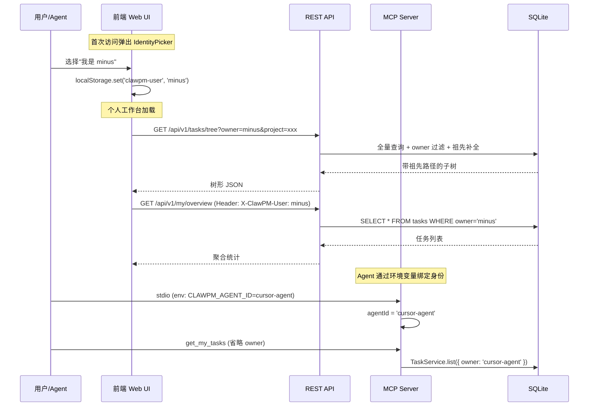
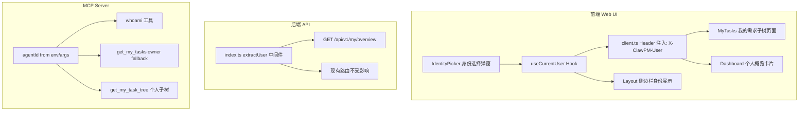
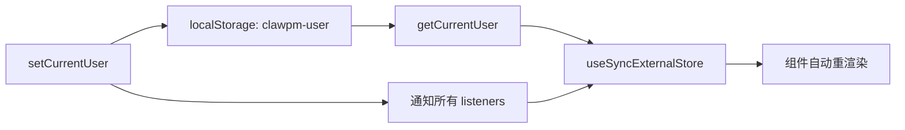

## 产品概述

ClawPM 当前是"上帝视角"的项目管理系统，所有人看到的是相同的全量数据，缺乏用户身份概念和个人视角。本次迭代的核心目标是引入**协作与个人工作台**能力，让每个团队成员（人类和 Agent）都能清晰看到自己负责的任务，并且个人工作台要体现 ClawPM 的产品灵魂：**以需求树为底层驱动逻辑**。

## 核心功能

### F1: 轻量级用户身份识别

- 首次访问 Web UI 时弹出身份选择面板，从已有成员列表中选择"我是谁"（或快速创建新身份）
- 选择后将 identifier 持久化到 localStorage，后续请求通过 HTTP Header `X-ClawPM-User` 自动附带
- 不做密码/登录系统，只是"身份声明"——轻量、零摩擦
- 侧边栏底部显示当前身份，支持切换

### F2: 个人工作台——"我的需求子树"

核心设计理念：**不做扁平任务列表，而是从全局需求树中提取"我的子树"**，体现灵魂文档的核心思想——需求清晰知道来源，所有需求基于树的根节点衍生开枝散叶。

- 侧边栏"工作台"分组下新增"我的任务"入口
- 调用已有的 `GET /api/v1/tasks/tree?owner=xxx` 获取带祖先路径的树形数据
- 以缩进树形结构渲染：**我负责的节点高亮显示，祖先节点半透明作为上下文**
- 每个节点可以看到完整的"根目标 > 板块 > 父需求 > 当前任务"溯源路径
- 顶部统计条带展示：进行中、待验收、未开始、已逾期的任务数
- 支持快速推进状态操作

### F3: MCP Agent 身份自动绑定

- MCP stdio 模式支持通过环境变量 `CLAWPM_AGENT_ID` 或启动参数 `--agent-id=xxx` 传入 Agent 身份
- `get_my_tasks` 工具在有绑定身份时可省略 owner 参数，自动使用会话身份
- 新增 `whoami` MCP 工具，让 Agent 查询自己的身份信息
- 新增 `get_my_task_tree` MCP 工具，返回带祖先路径的个人需求子树

### F4: 仪表盘增强——个人视角

- 已设置身份时，仪表盘顶部新增"我的概览"卡片区：进行中任务数、待验收数、逾期任务数
- 未设置身份时不显示此区域

## 技术栈

沿用现有项目技术栈，不引入新依赖：

- **后端**: Node.js + Fastify + TypeScript + Drizzle ORM + SQLite
- **前端**: React 18 + Vite + TypeScript + Tailwind CSS + TanStack Query
- **MCP**: @modelcontextprotocol/sdk (stdio + SSE)

## 实现方案

### 整体策略

采用**轻量身份声明**机制，最大化复用现有基础设施。核心设计思路：

1. **前端**：用户从成员列表选择自己的 `identifier`，存入 localStorage，后续所有请求通过 HTTP Header `X-ClawPM-User` 传递身份。实现模式完全复用现有的 `useActiveProject` / `getActiveProject` / `subscribeActiveProject` 模式（`useSyncExternalStore` + localStorage + listeners）
2. **后端**：新增 `GET /api/v1/my/overview` 个人统计端点；**树形数据直接复用已有** `GET /api/v1/tasks/tree?owner=xxx`（已具备祖先路径补全逻辑），无需新建树形端点
3. **MCP**：`createMcpServer` 接受可选 `agentId` 参数，stdio 入口从环境变量/命令行参数读取

### 关键技术决策

| 决策 | 选择 | 理由 |
| --- | --- | --- |
| 身份存储 | localStorage + Header | 与现有 activeProject 模式一致，轻量无认证，复用成熟模式 |
| 个人树形数据 | 复用 `getTree({ owner })` | 该方法已有完整的 owner 过滤 + 祖先路径补全逻辑（task-service.ts L354-370），无需新建后端逻辑 |
| 前端身份 Hook | `useSyncExternalStore` | 与 `useActiveProject.ts` 完全同构，保持代码风格一致 |
| MCP Agent 身份 | 环境变量 `CLAWPM_AGENT_ID` | 零改动对接，Agent 配置只需加一个环境变量 |
| 个人概览端点 | 新增 `/api/v1/my/overview` | 仪表盘需要聚合统计数据（按状态计数/逾期计数），复用 `TaskService.list` 做聚合 |


### 性能考量

- `GET /api/v1/tasks/tree?owner=xxx` 已有索引支持，祖先补全是内存操作（全量加载一次后在内存中向上回溯）
- 个人工作台前端只需一次树查询 + 一次概览查询，不存在 N+1 问题
- `getMyOverview` 端点基于 `TaskService.list({ owner })` 做内存聚合，单次 DB 查询

### 向后兼容

- `X-ClawPM-User` Header 完全可选，不传则系统行为与现在完全一致
- MCP `get_my_tasks` 的 `owner` 参数保留为 optional（从 required 降级），不传时 fallback 到 session 身份
- 不改动任何现有端点逻辑和现有认证机制（Bearer Token 并行）
- 新增路由和组件，不修改已有页面行为逻辑

### 数据流



## 架构设计

### 模块分工



### 前端身份管理模式（对齐现有 useActiveProject）



## 目录结构

```
e:/clawpm/
├── docs/
│   ├── PRD.md                              # [MODIFY] 新增 v2.3 章节：协作与身份识别——F1身份选择、F2个人工作台（我的需求子树）、F3 MCP Agent绑定、F4仪表盘个人视角。个人工作台核心设计强调"需求树驱动"而非扁平列表
│   └── TechDesign.md                       # [MODIFY] 新增 v2.4 技术设计章节：身份传递机制（Header + localStorage）、个人概览API、MCP会话身份、前端 useCurrentUser hook、MyTasks 树形渲染方案
├── server/src/
│   ├── index.ts                            # [MODIFY] 在 auth hook 中增加 extractUser 逻辑，从 X-ClawPM-User Header 读取用户身份注入到 req.clawpmUser，供后续路由使用
│   ├── api/routes.ts                       # [MODIFY] 新增 GET /api/v1/my/overview 端点，从 Header 读取用户身份，聚合该用户的任务统计（按状态计数、逾期计数等）
│   └── mcp/
│       ├── server.ts                       # [MODIFY] createMcpServer 接受 options?.agentId 参数；get_my_tasks 的 owner 改为 optional，未传时 fallback 到 agentId；新增 whoami 和 get_my_task_tree 工具
│       └── stdio.ts                        # [MODIFY] 从环境变量 CLAWPM_AGENT_ID 或命令行参数 --agent-id 读取 Agent 身份，传入 createMcpServer({ agentId })
├── web/src/
│   ├── api/client.ts                       # [MODIFY] request() 函数自动注入 X-ClawPM-User Header（从 getCurrentUser 读取）；新增 getMyOverview() API 方法
│   ├── lib/
│   │   ├── useActiveProject.ts             # 不变（参考模式）
│   │   └── useCurrentUser.ts              # [NEW] 当前用户身份管理，完全对齐 useActiveProject 模式：useSyncExternalStore + localStorage('clawpm-user') + listeners。导出 useCurrentUser/getCurrentUser/setCurrentUser/clearCurrentUser/subscribeCurrentUser
│   ├── components/
│   │   ├── Layout.tsx                      # [MODIFY] 侧边栏"工作台"分组下新增"我的任务"导航项（仪表盘之后）；底部 footer 区改为显示当前身份头像+名称+切换按钮；首次无身份时自动弹出 IdentityPicker
│   │   └── IdentityPicker.tsx             # [NEW] 身份选择弹窗组件：全屏遮罩居中卡片，列出当前项目成员（彩色圆形头像+名称+类型标签），支持快速创建新身份，点选即确认
│   └── pages/
│       ├── MyTasks.tsx                     # [NEW] 个人工作台核心页面——"我的需求子树"。调用 getTaskTree({ owner }) 获取带祖先路径的树形数据；以缩进树形渲染，我负责的节点高亮+祖先节点半透明上下文；顶部统计条带（进行中/待验收/未开始/逾期）；支持快速推进状态。复用 Requirements.tsx 的 TreeNodeRow 渲染模式但增加"高亮我的/半透明祖先"逻辑和面包屑溯源
│       └── Dashboard.tsx                   # [MODIFY] 已设置身份时，统计卡片行上方新增"我的概览"条带（浅靛蓝背景），紧凑展示：我的进行中(n)、待验收(n)、逾期(n)；调用 getMyOverview()
└── web/src/App.tsx                         # [MODIFY] 添加 /my-tasks 路由指向 MyTasks 页面
```

## 关键代码结构

```typescript
// web/src/lib/useCurrentUser.ts
// 完全对齐 useActiveProject.ts 模式
export function getCurrentUser(): string | null;
export function setCurrentUser(identifier: string): void;
export function clearCurrentUser(): void;
export function subscribeCurrentUser(listener: () => void): () => void;
export function useCurrentUser(): string | null;  // useSyncExternalStore hook
```

```typescript
// server/src/mcp/server.ts — 签名变更
export function createMcpServer(options?: { agentId?: string }): McpServer;
// agentId 来自 stdio 的环境变量/参数，用于 get_my_tasks 和 whoami 的身份 fallback
```

## 设计风格

延续 ClawPM 现有的简约专业风格。所有新增组件保持与侧边栏（220px 宽，白底、灰边框 #e8eaed）、仪表盘（圆角卡片 rounded-2xl、gray-200 边框、shadow-sm）、需求树列表（缩进式 TreeNodeRow、状态色点、标签 pill）一致的视觉语言。

### 页面设计

#### 1. 身份选择弹窗 (IdentityPicker)

- **触发方式**: 首次访问时全屏半透明遮罩（bg-black/50），居中白色卡片（max-w-md）
- **卡片结构**: 顶部标题"选择你的身份"（text-lg font-bold），副标题"请选择你在项目中的角色"（text-sm text-gray-400）
- **成员列表**: 2 列网格布局，每个成员卡片包含：左侧彩色圆形头像（member.color 背景，白色首字母）、中间名称（font-medium）+ identifier（text-xs text-gray-400）、右侧类型标签 pill（human 蓝色 / agent 紫色）
- **交互**: 卡片 hover 时 border-indigo-300 + shadow-md 过渡；点选即确认并关闭弹窗
- **底部**: "创建新身份"展开区，包含姓名+标识输入框和确认按钮

#### 2. 个人工作台——我的需求子树 (MyTasks)

- **顶部统计条**: 4 个紧凑统计 pill 横排（inline-flex gap-3），分别为"进行中"（靛蓝底）、"待验收"（琥珀底）、"未开始"（蓝底）、"已逾期"（红底），每个 pill 内含数字+标签
- **主体区域**: 白色圆角卡片内展示缩进树形列表，复用 Requirements.tsx 的缩进+展开模式
- **节点差异化**: 我负责的节点（owner === currentUser）正常显示，文字 text-gray-900，左侧有靛蓝竖条标记（3px 宽 bg-indigo-500 rounded）；祖先上下文节点 opacity-50，文字 text-gray-400，不可交互推进
- **面包屑**: 每个"我的节点"上方显示微型面包屑路径（text-[10px] text-gray-400），格式为"根节点 > 父节点 > ..."，用 > 分隔
- **快速操作**: 我负责的节点 hover 时右侧出现"推进状态"按钮（小箭头图标），点击直接推进到下一个合法状态
- **空状态**: 居中大号树形图标（opacity-30），"暂无分配给你的任务"文案

#### 3. 仪表盘个人概览条带

- 在现有 4 列统计卡片上方，新增一条浅靛蓝背景条带（bg-indigo-50 border border-indigo-100 rounded-xl p-4）
- 左侧文案"我的概览"（text-sm font-semibold text-indigo-700）+ 用户名
- 右侧 3 个紧凑数据项：进行中(n)、待验收(n)、逾期(n)，用 indigo/amber/red 色点标记
- 未设置身份时整条不渲染

#### 4. 侧边栏身份区

- 侧边栏底部 footer 区域改造：左侧彩色圆形头像（16px，member.color）+ 用户名（text-xs font-medium），右侧切换图标按钮（刷新箭头，点击弹出 IdentityPicker）
- 未设置身份时显示"请选择身份"灰色文字（text-gray-400 cursor-pointer），点击弹出选择器

## Agent Extensions

### SubAgent

- **code-explorer**
- 用途: 在实现过程中验证代码修改的影响范围，查找所有需要同步修改的引用点，确认 API 调用链完整性
- 预期结果: 确保所有文件引用和依赖关系正确更新，避免遗漏