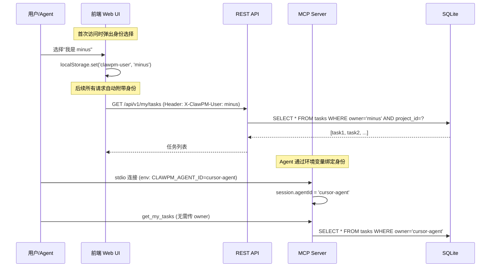
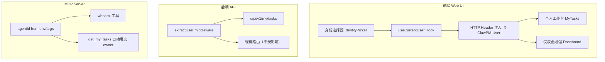

## 产品概述

ClawPM 当前是一个"全局视角"的项目管理系统，所有人/Agent 看到的都是相同的全量数据，无法区分"我的任务"和"别人的任务"。系统缺乏用户身份概念——没有登录、没有"当前用户"、没有个人工作台。每个 Agent 调用 MCP 的 `get_my_tasks` 也需要手动传 `owner` 参数，缺乏自动识别机制。

本次迭代的核心目标是：**让每个团队成员（人类和 Agent）都能清晰看到自己负责的任务**，实现真正的团队协作能力。

## 核心功能

### F1: 轻量级用户身份识别

- 首次访问 Web UI 时，弹出身份选择面板，从已有成员列表中选择"我是谁"（或快速创建新身份）
- 选择后将 `identifier` 持久化到 localStorage，后续请求自动附带
- 不做密码/登录系统，只是"身份声明"——轻量、零摩擦
- 支持切换身份

### F2: 个人工作台（"我的任务"页面）

- 侧边栏新增"我的任务"入口，位于"工作台"分组下、仪表盘之后
- 展示当前用户（by identifier）负责的所有任务，按状态分组展示
- 显示任务的标题、状态、优先级、所属项目/板块、截止日期、进度
- 支持快速操作：推进状态、更新进度
- 空状态友好提示

### F3: MCP Agent 身份自动绑定

- MCP stdio 模式支持通过启动参数或环境变量传入 Agent 身份 `--agent-id=xxx`
- MCP SSE 模式支持通过连接参数传入 Agent 身份
- `get_my_tasks` 工具在有绑定身份时可省略 `owner` 参数，自动使用会话身份
- 新增 `whoami` MCP 工具，让 Agent 查询自己的身份信息

### F4: 仪表盘增强——个人视角

- 仪表盘顶部新增"我的概览"卡片区：我的进行中任务数、待验收数、逾期数
- 当已设置身份时自动展示个人维度数据

## 技术栈

沿用现有项目技术栈，不引入新依赖：

- **后端**: Node.js + Fastify + TypeScript + Drizzle ORM + SQLite
- **前端**: React 18 + Vite + Tailwind CSS + TanStack Query
- **MCP**: @modelcontextprotocol/sdk (stdio + SSE)

## 实现方案

### 整体策略

采用**轻量身份声明**而非完整认证系统。核心机制是：

1. **前端**：用户从成员列表选择自己的 `identifier`，存入 localStorage，后续所有请求通过 HTTP Header `X-ClawPM-User` 传递
2. **后端**：API 路由从 Header 读取用户身份，提供 `GET /api/v1/my/tasks` 等个人维度端点
3. **MCP**：通过环境变量 `CLAWPM_AGENT_ID` 或 `--agent-id` 参数绑定 Agent 身份到 MCP session

关键技术决策：

- **不做认证/密码**：ClawPM 定位为团队内部工具，身份声明足够，避免增加使用摩擦
- **Header 传递而非 Cookie/Session**：与现有 Bearer Token 认证并行，不冲突，Agent/Browser 通用
- **成员列表复用**：不新建用户表，直接基于现有 `members` 表的 `identifier` 作为身份标识
- **跨项目身份一致**：`identifier` 是全局身份（虽然 member 按项目隔离，但同一个人在不同项目用相同 identifier）

### 数据流



## 实现笔记

### 性能

- `GET /api/v1/my/tasks` 直接复用 `TaskService.list({ owner, projectId })`，已有索引
- 个人工作台前端只需一个查询，不需要拉取全量任务

### 向后兼容

- `X-ClawPM-User` Header 完全可选，不传则系统行为与现在完全一致
- MCP `get_my_tasks` 的 `owner` 参数保留，只是变为"不传时 fallback 到 session 身份"
- 不改动现有认证逻辑（Bearer Token 并行）

### 爆炸半径控制

- 身份选择是纯前端 localStorage + Header 注入，不影响任何现有功能
- 新增 `/api/v1/my/*` 端点，不修改现有端点
- MCP `whoami` 是只读工具，零风险

## 架构设计

### 系统架构变更

在现有三层架构基础上，增加身份识别层：



### 模块分工

| 层 | 组件 | 职责 |
| --- | --- | --- |
| 前端 | `useCurrentUser` hook | 管理当前用户身份 state，提供 getter/setter |
| 前端 | `IdentityPicker` 组件 | 首次身份选择 + 切换身份的 UI |
| 前端 | `MyTasks` 页面 | 个人工作台，展示我的任务 |
| 后端 | `extractUser` 中间件 | 从 Header 提取用户身份 |
| 后端 | `/api/v1/my/tasks` | 个人任务查询端点 |
| MCP | session agentId | Agent 身份绑定到 MCP 会话 |
| MCP | `whoami` 工具 | Agent 查询自身身份 |


## 目录结构

```
e:/clawpm/
├── docs/
│   ├── PRD.md                           # [MODIFY] 新增 v2.3 协作与身份识别章节：F1身份选择、F2个人工作台、F3 MCP Agent绑定、F4仪表盘个人视角
│   └── TechDesign.md                    # [MODIFY] 新增 v2.4 协作身份技术设计章节：身份传递机制、个人API端点、MCP会话身份、前端身份管理
├── server/src/
│   ├── index.ts                         # [MODIFY] 在 auth hook 中增加 extractUser 逻辑，从 X-ClawPM-User Header 读取用户身份注入 req.clawpmUser
│   ├── api/routes.ts                    # [MODIFY] 新增 GET /api/v1/my/tasks（个人任务列表）和 GET /api/v1/my/overview（个人概览统计）两个端点，复用 TaskService.list
│   └── mcp/
│       ├── server.ts                    # [MODIFY] 为 createMcpServer 传入 agentId 参数；get_my_tasks 在 owner 未传时 fallback 到 agentId；新增 whoami 工具
│       └── stdio.ts                     # [MODIFY] 从环境变量 CLAWPM_AGENT_ID 或命令行参数 --agent-id 读取 Agent 身份，传入 createMcpServer
├── web/src/
│   ├── api/client.ts                    # [MODIFY] request() 函数自动注入 X-ClawPM-User Header；新增 getMyTasks() 和 getMyOverview() API 方法
│   ├── lib/
│   │   ├── useActiveProject.ts          # 不变
│   │   └── useCurrentUser.ts            # [NEW] 当前用户身份管理 hook，基于 useSyncExternalStore，读写 localStorage 的 clawpm-user，提供 subscribe 机制
│   ├── components/
│   │   ├── Layout.tsx                   # [MODIFY] 侧边栏"工作台"分组下新增"我的任务"导航项；底部 footer 区显示当前身份和切换按钮；集成 IdentityPicker
│   │   └── IdentityPicker.tsx           # [NEW] 身份选择弹窗组件：列出当前项目成员让用户选择"我是谁"，支持快速创建新身份，首次未选择时自动弹出
│   └── pages/
│       ├── MyTasks.tsx                  # [NEW] 个人工作台页面：按状态分组展示我的任务（进行中/未开始/验收中/未排期/已完成），支持快速推进状态和更新进度
│       └── Dashboard.tsx                # [MODIFY] 已设置身份时，仪表盘顶部新增"我的概览"卡片区：进行中任务数、待验收数、逾期任务数、今日到期数
└── web/src/App.tsx                      # [MODIFY] 添加 /my-tasks 路由指向 MyTasks 页面
```

## 关键代码结构

```typescript
// web/src/lib/useCurrentUser.ts — 核心身份管理接口
interface CurrentUser {
  identifier: string;    // = members.identifier = tasks.owner
  name?: string;         // 显示名称（缓存）
  type?: 'human' | 'agent';
}

// 导出函数签名
export function useCurrentUser(): string | null;  // 返回 identifier 或 null
export function setCurrentUser(identifier: string): void;
export function getCurrentUser(): string | null;
export function clearCurrentUser(): void;
export function subscribeCurrentUser(listener: () => void): () => void;
```

```typescript
// server/src/mcp/server.ts — createMcpServer 签名变更
export function createMcpServer(options?: { agentId?: string }): McpServer;
// agentId 来自 stdio 的环境变量/参数，或 SSE 连接的查询参数
```

## 设计风格

延续 ClawPM 现有的简约专业风格，新增组件保持与侧边栏、仪表盘、任务列表等一致的视觉语言。

### 页面规划

#### 1. 身份选择弹窗 (IdentityPicker)

- **触发方式**: 首次访问时全屏遮罩居中弹窗；后续可通过侧边栏底部点击头像/名称触发
- **布局**: 居中卡片（max-w-md），顶部标题"选择你的身份"，成员列表网格（2列），每个成员卡片显示彩色圆形头像+名称+类型标签(human/agent)
- **底部**: "创建新身份"按钮，展开后显示姓名+标识输入框
- **交互**: 点选即确认，卡片 hover 有轻微放大和边框高亮

#### 2. 个人工作台 (MyTasks)

- **顶部统计栏**: 4个数据卡片横排——进行中、待验收、未开始、已逾期，使用对应状态色
- **主体区域**: 按状态分组的任务卡片列表，使用手风琴折叠，每组标题显示计数
- **任务卡片**: 左侧状态色条、标题、优先级徽章、所属板块、截止日期、进度条
- **卡片操作**: hover 显示"推进状态"按钮（与 TaskDetail 的推进逻辑一致）
- **空状态**: 居中插画风格提示"暂无分配给你的任务"

#### 3. 仪表盘增强 — 个人视角

- 在现有仪表盘统计卡片行上方，新增"我的概览"条带（浅靛蓝背景），紧凑地展示：我的进行中(n)、待验收(n)、逾期(n)
- 未设置身份时不显示此区域

#### 4. 侧边栏身份区

- 侧边栏底部 footer 区域改为：左侧彩色圆形头像+用户名，右侧切换图标按钮
- 未设置身份时显示"请选择身份"灰色文字+点击引导

## Agent Extensions

### SubAgent

- **code-explorer**
- 用途: 在实现过程中验证代码修改的影响范围，查找所有需要同步修改的引用点
- 预期结果: 确保所有文件引用和依赖关系正确更新