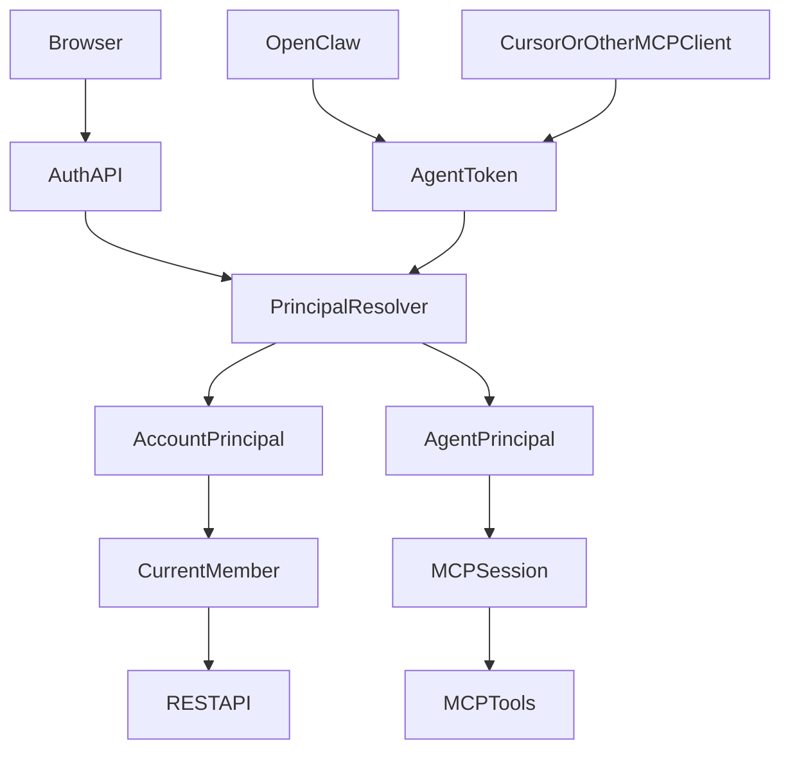

# Auth, Agent, OpenClaw Tech Design

## 1. 设计原则

1. 认证主体与业务身份分层
2. 兼容现有 `members.identifier` 语义
3. 人与 Agent 使用不同的登录方式，但统一进入 principal 解析
4. 优先保证 OpenClaw / MCP 接入链路短、少配置、可复制

## 2. 架构总览



## 3. 数据模型

### 3.1 accounts

- `id`
- `username`
- `password_hash`
- `display_name`
- `status`
- `created_at`
- `updated_at`
- `last_login_at`

用途：

- 保存人类账号的登录凭证与基础资料

### 3.2 account_sessions

- `id`
- `account_id`
- `token_prefix`
- `token_hash`
- `status`
- `expires_at`
- `last_used_at`
- `created_at`

用途：

- 保存浏览器持久会话
- 统一采用 bearer token，避免首版引入 cookie / csrf 复杂度

### 3.3 account_member_bindings

- `id`
- `account_id`
- `project_id`
- `member_identifier`
- `is_default`
- `created_at`

用途：

- 表示某个账号在某个项目内可切换到哪些成员身份

### 3.4 agent_tokens

- `id`
- `project_id`
- `member_identifier`
- `client_type`
- `name`
- `token_prefix`
- `token_hash`
- `status`
- `expires_at`
- `last_used_at`
- `created_at`

用途：

- 让 Agent / OpenClaw 通过独立 token 访问 MCP

### 3.5 auth_audit_logs

- `id`
- `project_id`
- `actor_type`
- `actor_id`
- `action`
- `target_type`
- `target_id`
- `metadata`
- `created_at`

用途：

- 记录登录、选成员、创建 token、轮换、吊销、连接 MCP 等关键操作

## 4. Principal 模型

后端统一解析出：

```ts
type ClawpmPrincipal =
  | {
      type: 'account';
      accountId: number;
      username: string;
      displayName: string;
      memberIdentifier: string | null;
      authSource: 'session';
    }
  | {
      type: 'agent';
      memberIdentifier: string;
      tokenId: number;
      clientType: string;
      authSource: 'agent_token';
    }
  | {
      type: 'legacy';
      memberIdentifier: string | null;
      authSource: 'legacy_api_token';
    };
```

兼容字段：

- `req.clawpmPrincipal`
- `req.clawpmUser`
- `req.clawpmMember`

其中：

- `clawpmUser` / `clawpmMember` 都映射到业务身份 `member.identifier`
- 旧逻辑依然可运行

## 5. 认证中间件

在 `server/src/index.ts` 中统一执行：

1. 跳过公开资源：
   - `/health`
   - 前端静态资源
   - `POST /api/v1/auth/register`
   - `POST /api/v1/auth/login`
   - `POST /api/v1/intake`
2. 从 `Authorization: Bearer <token>` 或 `?token=` 读取 token
3. 按优先级解析：
   - account session
   - agent token
   - legacy `CLAWPM_API_TOKEN`
4. 解析成功后写入 request 上下文
5. 若解析失败且目标为 `/api` 或 `/mcp`，返回 401

### 5.1 成员解析规则

对于账号登录：

1. 优先读取请求头 `X-ClawPM-Member`
2. 若该成员属于账号已绑定列表，则使用它
3. 否则使用默认绑定成员
4. 若没有任何绑定，则 `memberIdentifier = null`

对于 Agent token：

- 直接使用 token 绑定的 `member_identifier`

对于 legacy token：

- 保持旧 `X-ClawPM-User` 语义

## 6. REST API 设计

### 6.1 Auth API

- `POST /api/v1/auth/register`
- `POST /api/v1/auth/login`
- `POST /api/v1/auth/logout`
- `GET /api/v1/auth/me`
- `POST /api/v1/auth/select-member`

返回结构：

```ts
{
  account: { id, username, displayName },
  currentMember: Member | null,
  bindings: Member[],
  token?: string
}
```

### 6.2 Agent API

- `POST /api/v1/agents`
- `POST /api/v1/agents/:identifier/tokens`
- `POST /api/v1/agents/:identifier/tokens/:id/rotate`
- `POST /api/v1/agents/:identifier/tokens/:id/revoke`
- `GET /api/v1/agents/:identifier/tokens`
- `GET /api/v1/agents/:identifier/openclaw-config`

### 6.3 OpenClaw 配置接口

返回内容包含：

- `sseUrl`
- `token`
- `serverName`
- `configJson`
- `configBase64`
- `powershellCommand`
- `shellCommand`

## 7. MCP 设计

### 7.1 SSE

当前问题：

- 只有一个全局 MCP server
- 没有按连接绑定 Agent 身份

改造方案：

1. `/mcp/sse` 接入前先解析 token
2. token 必须对应一个 `agentPrincipal` 或兼容 legacy principal
3. 为每个连接创建独立 `createMcpServer({ principal })`
4. `transports[sessionId]` 同时记录 transport 与 mcp server
5. 工具内部通过 principal 解析当前成员身份

### 7.2 stdio

新增环境变量：

- `CLAWPM_AGENT_TOKEN`

兼容保留：

- `CLAWPM_AGENT_ID`
- `--agent-id=...`

优先级：

1. `CLAWPM_AGENT_TOKEN`
2. `CLAWPM_AGENT_ID`
3. `--agent-id=...`

### 7.3 MCP 工具上下文

MCP server 创建时统一注入：

```ts
createMcpServer({
  principal,
  memberIdentifier,
})
```

依赖当前身份的工具全部改为从该上下文取值，例如：

- `whoami`
- `get_my_tasks`
- `get_my_task_tree`
- `list_notifications`
- `grant_permission`
- `review_intake`

## 8. 前端设计

## 8.1 状态拆分

新增：

- `useAuthSession.ts`
- `useCurrentMember.ts`

兼容保留：

- `useCurrentUser.ts` 作为 `useCurrentMember` 的轻量兼容封装

### 8.2 页面流程

#### 登录页 / 首配页

复用原 `Onboarding` 路由，但职责调整为：

1. 登录 / 注册
2. 自动获取当前会话
3. 若没有成员绑定，则进入绑定成员步骤
4. 完成后进入工作台

#### 成员切换

`IdentityPicker` 改成仅显示当前账号已绑定的成员，不再直接列出整个项目所有成员。

#### Agent 管理

在 `Members` 页面增加：

- Agent token 管理
- OpenClaw 配置生成
- token 轮换/吊销

## 9. 兼容迁移

### 9.1 后端兼容

过渡期保留：

- `CLAWPM_API_TOKEN`
- `X-ClawPM-User`
- `CLAWPM_AGENT_ID`

### 9.2 前端兼容

过渡期允许：

- `useCurrentUser()` 继续读取当前成员
- 老页面不必一次性全部重写

### 9.3 逐步收口

1. 先让新账号体系可用
2. 再让新版前端默认使用新会话
3. 最后将共享 token 降为开发模式

## 10. 安全策略

1. 会话 token 只保存 hash，不明文落库
2. Agent token 只在创建时明文返回一次
3. token 前缀可展示，完整 token 不回显
4. 支持 token 轮换与吊销
5. 对敏感操作记录审计日志
