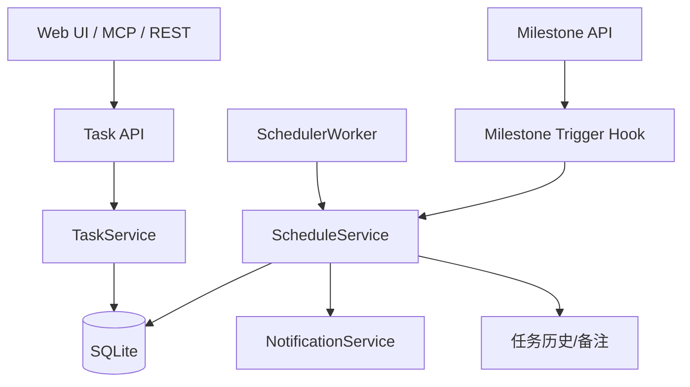
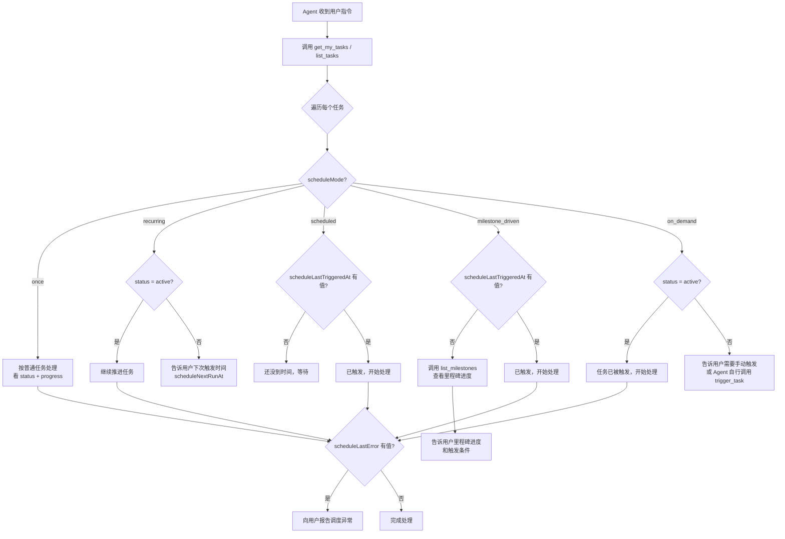

# 任务调度能力设计文档

## 1. 设计目标

本设计用于把现有"只保存字段、不执行"的调度能力，升级为真正可运行的任务调度系统。

目标：

1. 基于现有 `tasks.schedule_mode / schedule_cron / schedule_config` 扩展，不推翻现有模型
2. 单机单实例优先，先做稳定可用
3. REST、MCP、前端三端统一语义
4. 保证触发幂等，避免重复执行
5. 提供可观察的调度状态与运行历史

---

## 2. 总体架构



说明：

- `TaskService` 负责任务本体的创建、更新、读取
- `ScheduleService` 负责调度规则校验、下次执行时间计算、执行触发
- `SchedulerWorker` 负责周期扫描 due 任务
- `Milestone Trigger Hook` 负责在里程碑状态变化时触发关联任务

---

## 3. 数据模型设计

### 3.1 复用现有字段

当前 `tasks` 表已有：

- `schedule_mode`
- `schedule_cron`
- `schedule_config`

这些字段继续保留，作为调度配置主入口。

### 3.2 tasks 表新增运行态字段

建议新增以下字段：

| 字段 | 类型 | 说明 |
|------|------|------|
| `schedule_next_run_at` | TEXT | 下一次计划触发时间（ISO 时间） |
| `schedule_last_triggered_at` | TEXT | 最近一次成功触发时间 |
| `schedule_paused` | INTEGER | 是否暂停，0/1 |
| `schedule_last_error` | TEXT | 最近一次调度错误信息 |

示例迁移：

```sql
ALTER TABLE tasks ADD COLUMN schedule_next_run_at TEXT;
ALTER TABLE tasks ADD COLUMN schedule_last_triggered_at TEXT;
ALTER TABLE tasks ADD COLUMN schedule_paused INTEGER NOT NULL DEFAULT 0;
ALTER TABLE tasks ADD COLUMN schedule_last_error TEXT;
```

设计说明：

- `schedule_next_run_at` 避免每次列表查询都现场解析 cron
- `schedule_paused` 便于临时停用调度而不丢配置
- `schedule_last_error` 便于排错和 UI 展示

### 3.3 新增 `task_schedule_runs` 表

用于记录每次调度触发历史与幂等键。

建议结构：

```sql
CREATE TABLE task_schedule_runs (
  id INTEGER PRIMARY KEY AUTOINCREMENT,
  project_id INTEGER NOT NULL,
  task_id INTEGER NOT NULL,
  task_str_id TEXT NOT NULL,
  run_key TEXT NOT NULL UNIQUE,
  trigger_type TEXT NOT NULL,
  trigger_source TEXT NOT NULL,
  scheduled_at TEXT,
  triggered_at TEXT NOT NULL,
  status TEXT NOT NULL,
  payload TEXT NOT NULL DEFAULT '{}',
  error_message TEXT,
  created_at TEXT NOT NULL DEFAULT (datetime('now'))
);
```

字段说明：

- `run_key`：幂等键，例如：
  - recurring: `taskId:recurring:2026-04-10T09:00:00+08:00`
  - scheduled: `taskId:scheduled:trigger_at`
  - milestone: `taskId:milestone:12:completed:2026-04-10T12:00:00Z`
  - manual: `taskId:manual:requestId`
- `status`：`triggered` / `skipped` / `failed`
- `payload`：附加触发参数 JSON

---

## 4. 配置模型设计

### 4.1 `schedule_mode` 语义

保持以下枚举：

- `once`
- `recurring`
- `scheduled`
- `milestone_driven`
- `on_demand`

### 4.2 `schedule_config` 结构规范

#### recurring

```json
{
  "timezone": "Asia/Shanghai",
  "start_at": "2026-04-10T00:00:00+08:00",
  "end_at": "2026-06-30T23:59:59+08:00",
  "auto_activate": true,
  "notify_owner": true,
  "notify_assignee": false,
  "reopen_on_trigger": false,
  "reset_progress_on_trigger": false
}
```

#### scheduled

```json
{
  "trigger_at": "2026-04-12T09:30:00+08:00",
  "timezone": "Asia/Shanghai",
  "auto_activate": true,
  "notify_owner": true,
  "notify_assignee": false,
  "reopen_on_trigger": false,
  "reset_progress_on_trigger": false
}
```

#### milestone_driven

```json
{
  "milestone_id": 12,
  "trigger_on": "completed",
  "auto_activate": true,
  "notify_owner": true,
  "notify_assignee": false,
  "reopen_on_trigger": false,
  "reset_progress_on_trigger": false
}
```

#### on_demand

```json
{
  "auto_activate": true,
  "notify_owner": true,
  "notify_assignee": false,
  "reopen_on_trigger": false,
  "reset_progress_on_trigger": false
}
```

---

## 5. 后端模块设计

### 5.1 新增 `ScheduleService`

建议新增文件：

- `server/src/services/schedule-service.ts`

核心职责：

1. 校验调度配置合法性
2. 计算 `next_run_at`
3. 扫描到期任务
4. 执行触发逻辑
5. 处理里程碑驱动事件
6. 记录运行历史

建议接口：

```ts
validateSchedule(input): void
computeNextRun(task, now): string | null
refreshNextRun(taskId): void
triggerTask(taskId, triggerContext): TriggerResult
processDueTasks(now): ProcessResult
handleMilestoneCompleted(milestoneId, now): void
listRuns(taskId): ScheduleRun[]
```

### 5.2 `SchedulerWorker`

建议新增文件：

- `server/src/scheduler/worker.ts`

启动方式：

- 在 `server/src/index.ts` 中启动
- 使用 `setInterval` 每 60 秒扫描一次到期任务
- 受环境变量控制：
  - `CLAWPM_SCHEDULER_ENABLED=true`
  - 默认本地开发/单机部署开启

示例流程：

```ts
setInterval(async () => {
  await ScheduleService.processDueTasks(new Date());
}, 60_000);
```

说明：

- 首版采用轮询即可，避免引入外部队列系统
- 当前项目主要是 SQLite + 单实例服务，轮询方案足够可控

### 5.3 Cron 解析

建议引入依赖：

- `cron-parser`

用途：

- 校验 `schedule_cron`
- 根据 `timezone` 计算下一次执行时间

说明：

- 不建议首版手写 cron 解析器
- `node-cron` 更偏"运行器"，本项目更需要"计算 next run + 轮询 due task"能力，因此 `cron-parser` 更合适

---

## 6. 触发执行设计

### 6.1 统一触发入口

所有触发都统一走：

```ts
ScheduleService.triggerTask(taskId, {
  triggerType,
  triggerSource,
  scheduledAt,
  payload,
  runKey,
})
```

触发来源包括：

- `scheduler_poller`
- `milestone_event`
- `manual_api`
- `manual_mcp`

### 6.2 幂等流程

触发前：

1. 生成 `runKey`
2. 查询 `task_schedule_runs.run_key`
3. 若已存在，则直接跳过
4. 若不存在，则开始执行

这样可避免：

- 同一分钟扫描两次
- milestone patch 重复提交
- 服务重启后补扫重复执行

### 6.3 状态处理规则

触发时按以下逻辑处理：

1. 若任务已归档：
   - 写 `skipped`
   - 不执行后续动作

2. 若任务状态为 `backlog` / `planned` 且 `auto_activate = true`：
   - 更新为 `active`

3. 若任务状态为 `done` / `review`：
   - 若 `reopen_on_trigger = true`：
     - 更新为 `active`
     - 可选重置进度
   - 否则：
     - 保持状态不变
     - 仅记录运行记录和通知

4. 写任务历史 / 备注：
   - 例如：`[系统调度] 2026-04-10 09:00 由 recurring 触发`

5. 发送通知：
   - `notify_owner = true` 时通知 owner
   - `notify_assignee = true` 时通知 assignee

### 6.4 下一次执行时间更新

触发完成后：

- `recurring`：重新计算下一次执行时间，写入 `schedule_next_run_at`
- `scheduled`：清空 `schedule_next_run_at`
- `milestone_driven`：是否只触发一次由配置决定；首版默认只触发一次
- `on_demand`：无 `next_run_at`

---

## 7. 里程碑驱动设计

### 7.1 触发入口

在里程碑更新接口中，当状态从非 `completed` 变为 `completed` 时，调用：

```ts
ScheduleService.handleMilestoneCompleted(milestoneId, now)
```

### 7.2 扫描范围

查询条件：

- `schedule_mode = 'milestone_driven'`
- `schedule_config.milestone_id = 当前里程碑`
- `schedule_paused = 0`
- 任务未归档

### 7.3 事件幂等

每次里程碑完成事件必须生成包含里程碑 ID 和时间戳的 `runKey`，避免重复触发。

---

## 8. REST API 设计

### 8.1 创建/更新任务

继续沿用现有接口，但增强后端校验。

输入字段保持：

- `schedule_mode`
- `schedule_cron`
- `schedule_config`

返回字段新增：

- `scheduleNextRunAt`
- `scheduleLastTriggeredAt`
- `schedulePaused`
- `scheduleLastError`

### 8.2 新增手动触发接口

**POST** `/api/v1/tasks/:taskId/trigger`

请求体：

```json
{
  "reason": "manual",
  "payload": {}
}
```

响应：

```json
{
  "ok": true,
  "taskId": "U-123",
  "triggeredAt": "2026-04-10T09:00:00+08:00",
  "runId": 18
}
```

### 8.3 新增运行记录查询接口

**GET** `/api/v1/tasks/:taskId/schedule-runs`

用于任务详情页展示调度历史。

---

## 9. Agent ↔ 调度系统交互协议设计

### 9.1 交互模型总述

ClawPM 的调度系统采用 **"被动数据源"模型**：

```
                    ┌─────────────────────────┐
                    │    SchedulerWorker       │
                    │  (每 60s 扫描 due tasks) │
                    └────────┬────────────────┘
                             │ 触发 → 改状态 + 写日志
                             ▼
┌──────────┐    MCP     ┌─────────────────────────────────────┐
│  Agent   │──拉取──→   │  任务状态 + 调度元数据 + 运行日志    │
│(OpenClaw)│            │  (TaskService / ScheduleService)    │
│          │←──返回──   │                                     │
│          │            └─────────────────────────────────────┘
│          │    MCP
│          │──写入──→   trigger_task / update_task / pause / resume
└──────────┘
```

**关键设计决策**：调度系统**不**主动调用 Agent，Agent 永远是主动发起方。原因：

1. 不需要建立推送通道，Agent 离线也不影响调度
2. Agent 可以自行决定查询频率和处理优先级
3. 所有交互通过 MCP 工具，可审计、可回放

### 9.2 Agent 可见的调度数据字段

任务对象（通过 `get_task` / `list_tasks` / `get_my_tasks` 等工具返回）中，调度相关字段如下：

| 字段 | 类型 | 说明 | Agent 用途 |
|---|---|---|---|
| `scheduleMode` | string | 调度类型枚举 | Agent 判断"这个任务是什么类型的调度" |
| `scheduleCron` | string \| null | cron 表达式 | Agent 可展示给用户，不需要自己解析 |
| `scheduleConfig` | object | 调度附加配置 JSON | Agent 可读取 trigger_at / milestone_id 等细节 |
| `scheduleNextRunAt` | string \| null | 下一次计划触发时间（ISO） | **Agent 判断"还有多久会被触发"的核心字段** |
| `scheduleLastTriggeredAt` | string \| null | 最近一次成功触发时间 | Agent 判断"上一次什么时候跑的" |
| `schedulePaused` | boolean | 调度是否暂停 | Agent 判断"调度是否被人为停掉了" |
| `scheduleLastError` | string \| null | 最近一次调度错误 | Agent 判断"是否需要告警" |

### 9.3 每种调度模式下 Agent 的决策逻辑

#### `once` —— Agent 按普通任务处理

Agent 看到 `scheduleMode = 'once'` 时，直接忽略所有调度字段，按 `status` + `progress` 做正常任务处理。

#### `recurring` —— Agent 根据触发轮次判断当前该做什么

```
Agent 查到任务：
  scheduleMode = 'recurring'
  scheduleCron = '0 9 * * 1'
  scheduleNextRunAt = '2026-04-14T09:00:00+08:00'
  scheduleLastTriggeredAt = '2026-04-07T09:00:07+08:00'
  status = 'active'
  progress = 30

Agent 推理：
  → 这个任务每周一 9 点触发
  → 上一次触发是 4/7（已过），下一次 4/14
  → 当前 status=active，progress=30 → 本轮还在做，继续推进
```

另一种情况：

```
Agent 查到任务：
  status = 'done'
  scheduleNextRunAt = '2026-04-14T09:00:00+08:00'
  scheduleConfig.reopen_on_trigger = true

Agent 推理：
  → 本轮已经完成了
  → 4/14 系统会自动重新打开任务
  → 当前不需要做什么，告诉用户"下一轮在 4/14"
```

#### `scheduled` —— Agent 根据是否已触发判断

```
未触发前：
  scheduleNextRunAt = '2026-04-12T09:30:00+08:00'
  scheduleLastTriggeredAt = null
  status = 'planned'

  → Agent：还没到时间，等 4/12 自动触发

已触发后：
  scheduleNextRunAt = null
  scheduleLastTriggeredAt = '2026-04-12T09:30:05+08:00'
  status = 'active'

  → Agent：已触发，该开始处理了
```

#### `milestone_driven` —— Agent 联合查询里程碑状态

```
Agent 查到任务：
  scheduleMode = 'milestone_driven'
  scheduleConfig.milestone_id = 12
  scheduleLastTriggeredAt = null
  status = 'planned'

Agent 再调用 list_milestones 拿到里程碑 12 的状态：
  milestone 12: status = 'in_progress', progress = 75%

Agent 推理：
  → 里程碑还没完成（75%），这个任务还不会被触发
  → 告诉用户："等 M-12 完成后自动激活"
```

#### `on_demand` —— Agent 可以自己决定是否触发

```
Agent 查到任务：
  scheduleMode = 'on_demand'
  status = 'planned'
  scheduleLastTriggeredAt = null

Agent 推理：
  → 这个任务只能手动触发
  → 如果 Agent 判断时机合适，可以调用 trigger_task 来触发
  → 如果不确定，告诉用户"这个任务需要手动触发"
```

### 9.4 Agent 完整决策流程图



---

## 10. MCP 工具详细设计

### 10.1 保持现有字段命名

MCP 工具输入继续使用 snake_case：

- `schedule_mode`
- `schedule_cron`
- `schedule_config`

MCP 工具输出使用 camelCase（与数据库实体映射一致）：

- `scheduleMode`、`scheduleCron`、`scheduleConfig`
- `scheduleNextRunAt`、`scheduleLastTriggeredAt`、`schedulePaused`、`scheduleLastError`

### 10.2 现有工具增强

#### `get_task`

返回值中**必须**包含所有调度字段。当前实现已经通过 `JSON.stringify(task)` 返回完整对象，只需确保 TaskService 查询时 join/计算这些字段。

#### `list_tasks` / `get_my_tasks`

新增可选筛选参数：

```ts
schedule_mode: z.enum(['once', 'recurring', 'scheduled', 'milestone_driven', 'on_demand'])
  .optional()
  .describe('按调度类型筛选任务')
```

返回列表中每个任务对象都包含完整调度字段。

#### `get_tree_outline`

在轻量大纲中新增两个字段，让 Agent 可以快速扫描哪些任务有调度：

```ts
// 每个 outline node 新增：
{
  scheduleMode: string,       // 'once' | 'recurring' | ...
  scheduleNextRunAt: string | null,  // 下次触发时间
}
```

### 10.3 新增工具

#### `trigger_task` —— Agent 或用户手动触发任务

```ts
mcp.tool('trigger_task', '手动触发一个任务（适用于 on_demand 模式，也可对其他模式做强制触发）', {
  task_id: z.string().describe('任务 ID'),
  reason: z.string().optional().describe('触发原因说明'),
}, async (p) => {
  const result = await ScheduleService.triggerTask(p.task_id, {
    triggerType: 'manual',
    triggerSource: currentMember ? `mcp:${currentMember}` : 'mcp:anonymous',
    payload: { reason: p.reason },
    runKey: `${p.task_id}:manual:${Date.now()}`,
  });
  return { content: [{ type: 'text', text: JSON.stringify(result, null, 2) }] };
})
```

返回示例：

```json
{
  "ok": true,
  "taskId": "U-042",
  "triggeredAt": "2026-04-10T14:30:22+08:00",
  "runId": 31,
  "statusBefore": "planned",
  "statusAfter": "active"
}
```

#### `list_task_schedule_runs` —— 查看任务的触发历史

```ts
mcp.tool('list_task_schedule_runs', '查看任务的调度触发历史记录', {
  task_id: z.string().describe('任务 ID'),
  limit: z.number().optional().describe('返回条数上限，默认 20'),
}, async (p) => {
  const runs = ScheduleService.listRuns(p.task_id, p.limit || 20);
  return { content: [{ type: 'text', text: JSON.stringify(runs, null, 2) }] };
})
```

返回示例：

```json
[
  {
    "runId": 31,
    "taskId": "U-042",
    "triggerType": "manual",
    "triggerSource": "mcp:openclaw",
    "scheduledAt": null,
    "triggeredAt": "2026-04-10T14:30:22+08:00",
    "status": "triggered",
    "payload": { "reason": "用户要求立即执行" },
    "errorMessage": null
  },
  {
    "runId": 28,
    "taskId": "U-042",
    "triggerType": "recurring",
    "triggerSource": "scheduler_poller",
    "scheduledAt": "2026-04-07T09:00:00+08:00",
    "triggeredAt": "2026-04-07T09:00:07+08:00",
    "status": "triggered",
    "payload": {},
    "errorMessage": null
  }
]
```

Agent 通过这个列表可以：
- 看到最近每次触发是成功还是失败
- 看到触发来源（是系统自动还是手动）
- 发现 `status: 'skipped'` 的记录并告知用户为什么被跳过

#### `list_due_tasks` —— Agent 专用：快速拿到"该关注的调度任务"

```ts
mcp.tool('list_due_tasks', '查询即将触发或刚被触发的任务（Agent 决策入口）', {
  within_minutes: z.number().optional().describe('时间窗口（分钟），默认 60。查询 scheduleNextRunAt 在 [now - within, now + within] 范围内的任务'),
  project: z.string().optional().describe('项目 slug'),
  include_just_triggered: z.boolean().optional().describe('是否包含刚被触发（within 分钟内）的任务，默认 true'),
}, async (p) => {
  const projectId = resolveProject(p.project);
  const tasks = ScheduleService.listDueTasks({
    withinMinutes: p.within_minutes || 60,
    projectId,
    includeJustTriggered: p.include_just_triggered ?? true,
  });
  return { content: [{ type: 'text', text: JSON.stringify(tasks, null, 2) }] };
})
```

这个工具是 Agent 的"快捷入口"——不需要拉全量任务再逐个判断，直接问系统"最近有什么调度动态"。

返回示例：

```json
[
  {
    "taskId": "U-042",
    "title": "周报汇总",
    "scheduleMode": "recurring",
    "scheduleNextRunAt": "2026-04-14T09:00:00+08:00",
    "scheduleLastTriggeredAt": "2026-04-07T09:00:07+08:00",
    "status": "active",
    "dueType": "just_triggered"
  },
  {
    "taskId": "U-055",
    "title": "月度复盘",
    "scheduleMode": "scheduled",
    "scheduleNextRunAt": "2026-04-10T15:00:00+08:00",
    "scheduleLastTriggeredAt": null,
    "status": "planned",
    "dueType": "upcoming"
  }
]
```

#### `pause_task_schedule` / `resume_task_schedule` —— 暂停/恢复调度

```ts
mcp.tool('pause_task_schedule', '暂停任务的调度（不删除配置，仅停止触发）', {
  task_id: z.string(),
}, async (p) => {
  ScheduleService.setPaused(p.task_id, true);
  return { content: [{ type: 'text', text: `[OK] ${p.task_id} 调度已暂停` }] };
})

mcp.tool('resume_task_schedule', '恢复任务的调度', {
  task_id: z.string(),
}, async (p) => {
  ScheduleService.setPaused(p.task_id, false);
  // 恢复时重新计算 next_run_at
  ScheduleService.refreshNextRun(p.task_id);
  return { content: [{ type: 'text', text: `[OK] ${p.task_id} 调度已恢复` }] };
})
```

### 10.4 MCP 工具描述规范

所有调度相关 MCP 工具的 `describe()` 必须写清楚：

1. **这个工具做什么**（一句话）
2. **Agent 什么时候应该用它**（使用场景）
3. **返回什么数据**（关键字段）

示例：

```ts
mcp.tool('list_due_tasks',
  '查询即将触发或刚被触发的任务。Agent 可用此工具快速了解"最近有哪些调度动态"，无需遍历全量任务。返回值包含 taskId、scheduleMode、scheduleNextRunAt、dueType（upcoming/just_triggered）等字段。',
  { ... }
)
```

好的 tool description 可以让 LLM Agent 更准确地决定什么时候调用什么工具。

---

## 11. 前端设计

### 11.1 CreateTaskModal

在调度类型下拉后增加动态区域：

- `recurring`：
  - cron 输入框
  - 常用模板快捷按钮（每天/每周一/每月）
  - 时区选择
- `scheduled`：
  - `datetime-local` 输入框
- `milestone_driven`：
  - 里程碑下拉
  - 触发事件下拉（首版固定 `completed`）
- `on_demand`：
  - 提示文字："仅手动触发，不会自动执行"

### 11.2 TaskDetail

新增/增强：

- 调度配置编辑区
- 下次执行时间展示
- 上次执行时间展示
- 最近运行记录列表
- 暂停/恢复调度按钮
- `on_demand` 立即触发按钮

### 11.3 列表与思维导图

保留现有耳标；补充：

- hover tooltip：显示更具体的规则
- 异常配置状态展示
- 可选展示 `next_run_at`

---

## 12. 代码落点建议

### 12.1 后端

```text
server/
  src/
    db/
      schema.ts              ← tasks 增加运行态字段；新增 task_schedule_runs 表
      connection.ts          ← 迁移脚本
    services/
      task-service.ts        ← 保存/读取调度字段；返回 next/last 字段
      schedule-service.ts    ← 新增，调度核心逻辑
    scheduler/
      worker.ts              ← 新增，轮询调度器
    api/
      routes.ts              ← 新增 trigger / schedule-runs 接口；milestone 更新后 hook
    mcp/
      server.ts              ← 新增 trigger_task / list_task_schedule_runs / list_due_tasks / pause / resume
```

### 12.2 前端

```text
web/
  src/
    components/
      CreateTaskModal.tsx    ← 调度配置表单
      ScheduleConfigForm.tsx ← 新增，可复用动态配置组件
    pages/
      TaskDetail.tsx         ← 编辑调度配置、显示运行历史
      MindMap.tsx            ← 调度提示增强
      TaskList.tsx           ← next_run_at / 调度提示增强
    api/
      client.ts              ← 新增 triggerTask / getTaskScheduleRuns / listDueTasks
```

---

## 13. 迁移策略

### 13.1 老数据兼容

现有任务默认：

- `schedule_mode = 'once'`
- `schedule_config = '{}'`

无需额外数据修复。

### 13.2 next_run_at 回填

新增 `schedule_next_run_at` 后：

1. 迁移完成后首次服务启动
2. 扫描所有 `schedule_mode != 'once'` 的任务
3. 调用 `refreshNextRun(taskId)` 回填 `schedule_next_run_at`

### 13.3 灰度策略

建议先分三步落地：

1. **Phase 1**：字段校验、前端可配置、`next_run_at` 计算、手动触发、MCP 工具增强（Agent 可查询调度状态）
2. **Phase 2**：周期轮询触发、定时触发、`list_due_tasks` MCP 工具
3. **Phase 3**：里程碑驱动、暂停恢复、运行历史 UI 完整化

---

## 14. 测试策略

### 14.1 单元测试

覆盖：

- cron 解析合法/非法
- `next_run_at` 计算
- 模式字段校验
- runKey 幂等

### 14.2 集成测试

覆盖：

- 创建 recurring 任务 → 计算 next run
- 定时到点 → 自动触发并写运行记录
- 里程碑完成 → 触发 milestone_driven 任务
- 手动 trigger → 写运行记录 + 状态变更

### 14.3 MCP 交互测试

覆盖：

- Agent 调用 `get_task` 能拿到完整调度字段（含 nextRunAt / lastTriggeredAt）
- Agent 调用 `list_tasks` + `schedule_mode` 筛选能正确过滤
- Agent 调用 `list_due_tasks` 能拿到即将/刚触发的任务
- Agent 调用 `trigger_task` 能成功触发 on_demand 任务并看到状态变更
- Agent 调用 `list_task_schedule_runs` 能拿到历史记录
- Agent 调用 `pause_task_schedule` / `resume_task_schedule` 能正确切换暂停状态

### 14.4 UI 测试

覆盖：

- 调度模式切换时动态表单正确显示
- 非法配置不能保存
- 任务详情能看到 next/last/history

---

## 15. 风险与权衡

### 15.1 为什么不首版做"自动克隆实例"

因为 ClawPM 当前的任务树、状态、进度都围绕单一任务实体构建。若首版直接做"每次周期触发自动复制任务"，会引入：

- 父子树膨胀
- 状态归属复杂化
- 列表和甘特图语义变化

因此首版先采用"触发任务本体 + 记录运行历史"的方案，后续如确有强需求，再演进到"周期实例"模型。

### 15.2 为什么首版用轮询而不是外部队列

当前项目运行环境是 SQLite + 单实例为主，引入 BullMQ / Redis / 外部任务系统会显著增加复杂度。分钟级轮询已足够满足首版需求。

### 15.3 为什么保留 `schedule_config` JSON

不同模式配置差异较大，全部拆成强结构字段会导致表结构快速膨胀。当前保留：

- 主模式：强结构字段
- 模式细节：JSON 字段
- 运行态：单独强结构字段

可以兼顾灵活性与查询效率。

### 15.4 为什么调度系统不主动推送给 Agent

- Agent 不保证在线，推送会引入重试、超时、失败处理等复杂度
- Agent 拉取模式下，所有数据交互通过 MCP 工具，天然有日志、可审计
- 多个 Agent 可以各自按需拉取，不需要做多播/订阅机制
- 后续如果确实需要推送能力，可以通过 webhook + notification 机制扩展，不影响核心调度逻辑
